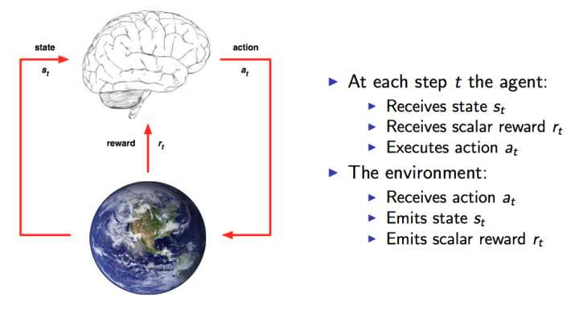

# TensorFlow强化学习DQN实战案例

本文主要介绍如何使用强化学习算法DQN来训练模型玩Catch这款游戏。

本文档中涉及的演示代码和数据集来源于网络，你可以在这里下载到：[DQN_CATCH_GAME.zip]()

本模块将介绍强化学习的入门知识，并通过案例来讲解强化学习的DQN算法，以及如何使用DQN进行训练，具体包括：

- 什么是强化学习
- 强化学习的基础知识
- 什么是DQN
- 如何实现DQN
- 演示用例执行和说明


# 什么是强化学习
当 DeepMind 的 AlphaGo 以 4-1 的大比分碾压人类选手-世界围棋冠军李世乭的时候，你是否再次感受到 AI 的恐惧呢？就在 AlphaGo 在围棋比赛中肆意碾压一个有一个围棋冠军的时候，强化学习（reinforce learning）便慢慢走上了世界舞台，进入了人们视野。

到底什么是强化学习呢？

强化学习是机器学习的一个分支，与机器学习经典的有监督学习、无监督学习问题不同，强化学习的特点之一是在交互中学习（Learning from Interaction）。

在于环境交互的过程中，根据环境给予的奖励和惩罚不断进行学习，从而修正自己交互的思路以期获得最大奖励。这样的方式非常类似于我们人类学习知识的过程。很多研究者相信，强化学习是我们创造通用人工智能（Artificial General Intelligence）的最佳手段。这是一个令人兴奋的领域，有着许多未解决的挑战和巨大的潜能。

在举例之前，先简单介绍下Catch游戏。


Catch 是一款街机游戏，即使没有玩过，也可能玩过类似的。游戏规则是：苹果会从屏幕顶部落下来，你需要操作下方的篮子来接着苹果。接住则得一分，接不住则扣一分。当然本文主要是讲解算法，会使用 10 * 10 数组表示屏幕，1 表示苹果位置，最后一行的连续几个 1 则表示篮子。

那么我们该如何训练一个 Agent 来玩好这个 Catch 游戏呢。上面提到强化学习是在交互中学习的。与什么交互呢？与环境 （Environment，下面都用 Env 代替），在 Catch 游戏中，Catch 游戏本身就 Env。当 Agent 操作篮子左右移动，最终接住了一个苹果，那么就告诉 Agent 你获得一分，否则就告诉 Agent 你被扣掉一分。如此反复训练，最终 Agent 就会玩 Catch 玩的越来越好，就像人类一样，越玩越熟练，得分越高。

我们把这个例子抽象一下便得到下面这个图([来自David Silver的课程ppt](http://www0.cs.ucl.ac.uk/staff/D.Silver/web/Teaching.html))：




这很类似与人与环境的交互学习方式。比如小时候玩游戏，即使没有人告诉你怎么玩，你也能很快学会。如果你发现你的操作（行为：Action）得到了分数（奖励：Reward），那么当下次游戏中出现了类似的情形（观察：Observation）你还会做类似的操作，因为这样有奖励。你就是上图中的“大脑（Agent）”，而游戏就是“地球（Env）”。
 
图上的状态（State）是人为定义划分的，比如 Catch 游戏中的 Agent 的状态就是篮子的位置。State 和 Action 是配对的，篮子的不同的位置能做不同的操作：Stay ， Move left ， Move right 中的某些组合。
 
总之，强化学习就是通过不断对环境做一些操作，根据环境反馈的奖励来学习到如何选择操作（即策略）。

# 强化学习的基础知识
有了上面感性的认识，下面梳理下强化学习的基础知识。在学习强化学习的时候，有很多公式表达和推到，本文力求去掉繁杂的公式，同时也能让大家了解到基础知识。

## 1. MDP（Markov Decision Process）
强化学习的重要基础是MDP了，主要体现在：

在状态 S_t 时，采取动作 A_t 后的状态 S_t+1 和收益 R_t+1 只与当前状态和动作有关，与历史状态无关。

## 2. 探索和利用
我们需要不断从状态 S_t 选择动作 A_t ，如何选择呢？

* 每次都随机选择
* 每次都选择最大奖励 R_t 对应的 A_t

这两种方式都各有优劣，我们可以将这俩思路结合起来，这就是 ε-贪心。
当然还有其他方式，比如 Softmax 。

## 3. 有模型学习 vs 免模型学习
这两个的区别在于：有模型学习的Agent 能在自己内部模拟出与 Env 相同或者近似的状况，当然常见的是免模型学习。

## 4. 有模型学习训练方法
主要由两个方法：策略迭代和值迭代。其中策略指的是如何从状态 S_t 中对应的动作 A_t 中做出选择。两种方式的迭代都是不断对表示函数进行评估和改进，直到收敛或者完成。其中策略迭代比较费时，因为策略迭代在每次改进之后需要重新评估策略，简单理解为从头玩一遍游戏。

## 5. 免模型学习方法
方法也是策略迭代和值迭代。但是主要解决的问题是如何产生数据。也就是知道状态-动作对应的奖励。
有两种方法：

* 蒙特卡罗学习
* 时序差分学习（TD）

蒙特卡罗学习就是通过多次“采样”，然后求取平均奖励来作为期望奖励的近似，从而解决免模型的策略无法评估问题，把免模型问题转化成有模型问题。

TD学习就是利用强化学习问题的 MDP 性质，将蒙特卡罗学习中每次的采样变成增量方式的。

比如求整数 1-n 的和。蒙特卡罗会先用生成一个数组保存 1-n 这些整数，然后遍历求和。而 TD 则采用累加的方式。

## 6. 同策略 vs 异策略
同策略指的是，如果我们使用了 ε-贪心方法，那么再更新策略的时候也需要采用相同的公式，从而产生的策略为 ε-贪心策略。

而异策略做到了，“采样”使用 ε-贪心方法，但是更新策略时不用。这是可行的，针对不同的采样轨迹，他们的区别只是“状态-动作对”的采样概率不同，我们可以通过公式转化，用其中一个采样轨迹表示另外一个。

# 什么是DQN
首先介绍下Q-learning 方法，Q-learning 方法就是 TD 中的异策略的 Value-based 的方法。

Value-based 方法，就是先评估每个 Action 的期望奖励，再根据期望奖励求最优策略的方法。

Q-learning 方法是强化学习的经典方法，但该方法也有很大的局限性。主要在于该方法根据过去出现过的状态，统计和迭代求解。如果一个状态从未出现过，该方法是无法处理的。Q-learning 方法是没有预测能力，也就是没有泛化能力。

如果需要有预测能力来应对没有出现过的状态，那么我们可以将其视为回归问题，回归问题在 MNIST 识别中就用到。自然想到和深度学习结合起来了，这就是 DQN 方法了。DQN 方法采用深度学习方法实现了端到端的期望奖励值的预测。

## 如何实现DQN
算法步骤如下：

1. 使用 DNN 预测每个动作的期望奖励值
2. 选择期望奖励值中最大的
3. 公式计算当前状态的期望奖励值
4. 计算期望奖励值与目标奖励值的差距作为 loss 值，训练 DNN

所有的采样轨迹都会被存储在经验回放类中，类似采样轨迹的缓存。这些数据同样能用做训练数据来训练 DNN。


# 演示用例执行和说明
各个文件的说明：

* catch_game.py：Catch 游戏相关
* deep_q_learning.py：main 函数文件，先训练，然后测试
* experience_relay.py：经验回放类，用于样本轨迹存储和期望奖励值更新，以及训练数据获取
* training_testing.py: 包括训练函数和测试函数

用例执行:

```
python deep_q_learning.py

```

如果你会使用 jupyter ，那么可以直接看参考中的 github 。


**当然示例代码中还有其他细节，这里就不做详细的描述了。可以直接阅读代码**

**您的任何问题和反馈都是受欢迎的。**

**祝您TensorFlow之旅愉快，祝好！**

# 更多帮助
在使用过程中如果遇到问题，您可以提交工单咨询，或者加入用户交流 QQ 群：661657497 寻求帮助

# 参考
1. 周志华 《机器学习》
2. [机器之心：深度强化学习入门：用TensorFlow构建你的第一个游戏AI
](https://www.jiqizhixin.com/articles/2017-11-16-7)
3. [JannesKlaas:sometimes_deep_sometimes_learning](https://github.com/JannesKlaas/sometimes_deep_sometimes_learning/blob/master/reinforcement.ipynb)