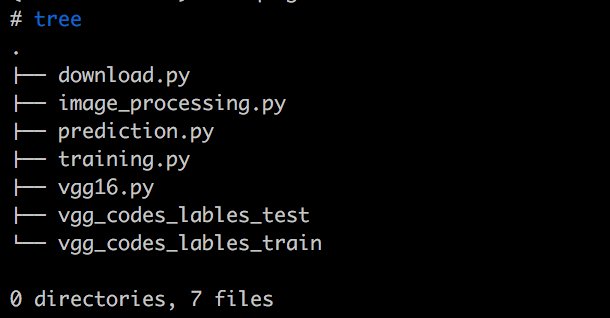

# TensorFlow迁移学习识花实战案例

本文主要介绍如何使用迁移学习训练图片识别花朵的模型，即识别出图片上是何种花朵。

本文档中涉及的演示代码和数据集来源于网络，你可以在这里下载到：[TRANSFER_LEARNING.zip]()

本模块将通过识花程序来讲解迁移学习，以及如何使用迁移学习来进行训练，具体包括：

- 什么是迁移学习
- 为什么要使用迁移学习
- 识花模型中迁移学习的思路
- 演示代码文件介绍
- 用例执行过程


# 什么是迁移学习
迁移学习是一种模型训练的技巧，指的是将在已有的源任务的模型中计算出来的知识迁移到目标任务上。似乎像是站在巨人肩膀上进行模型训练。

以人的学习过程为例：

人类的思维能够将学到的知识经验保留起来，并当做更高阶知识的基础。如果遇到新的情景，人们能够将已经学到的知识经验运用进来，从而更快速的掌握新的知识。比如学好数学，你能很快掌握物理、机器学习这些知识。

但是传统的机器学习却没有这种能力。比如识别图片中是否有花。如果训练的图片都是沙漠里的花，那么用这个模型判别水中的花就差很多了。


如何把这个道理，运用到深度学习中呢？

如果将识别图片中是否有梅花作为训练任务，那这个任务能否拆分一下呢？比如先识别图片上是否有花，然后再继续识别该花是否是梅花呢？

答案是肯定的。这里的识别图片中是否有花是定义中的源任务，而识别图片中是否有梅花则是定义中的目标任务。

所谓的迁移，就是将源任务的目标转化成目标任务的目标。在“识花”这一源任务的基础上添加此花是否是梅花这一逻辑，从而将“识花”转化成“识梅花”这一目标任务。

# 为什么要使用迁移学习

牛顿好像说过：站在巨人的肩膀上。

程序员们好像也说过：不要重复造轮子。

这些都告诉我们，善于利用已有的东西，能加快你的工作进展。大家写web程序，都会先选择一个合适的web框架，然后在封装好了的Request Handler里面添加上业务逻辑，从而能更快速的搭建起web服务。

深度学习是近年来人工智能领域最火热的话题之一。但是促使深度学习快速发展的，除了算法上的进步外，还有大量的数据以及强悍的计算力。普通人想要玩转深度学习，那么数据和计算力都是遥不可及的高山。

以 ImageNet 举例，该数据集有上千万的数据量。用英伟达 M40 GPU 完成 90-epoch ImageNet-1k 的ResNet-50 训练要花 14 天。 FaceBook 曾经用1小时训练了 ImageNet ，但是整套设备高达 400 多万美金。

而迁移学习能够让我们利用别人训练好的模型来继续训练，这无疑能帮我们省时省力省数据。

而本实例就可以在已有模型的基础上，利用迁移学习只使用几千张图片和一块 CPU 轻松完成识花训练，惊不惊喜？！


# 识花模型中迁移学习的思路
本实例使用的是 VGG 模型，首先介绍 VGG 模型，然后介绍如何使用已有的 VGG 模型来构造新的模型。
## VGG模型介绍
VGG 是视觉领域竞赛 ILSVRC 在 2014 年的获胜模型，在 ImageNet 上的错误率是 7.3% ，比前一年的 11.7% 的世界纪录大幅超前。VGG 基本上继承了 AlexNet 深的思想，并且发扬光大，VGG 模型更深。AlexNet 只用到了 8 层网络，而 VGG 的两个版本分别是 16 层网络版和 19 层网络版。但这俩版本有几乎完全一样的准确度，只是运算起来 VGG16 更快一些。

在该实践中，我们主要使用 VGG16。

VGG 的模型图大致如下：


VGG 的输入数据格式是 244 * 224 * 3 的像素数据，经过一系列的卷积神经网络和池化网络处理之后，输出的是一个 4096 维的特征数据，然后再通过 3 层全连接的神经网络处理，最终由 softmax 规范化得到分类结果。

在该实践中，我们只获取上图中 Layer6 之后的数据，也是 4096 维的特征值。具体做法就是代码中的：

```
codes = sess.run(vgg.relu6, feed_dict=feed_dict)
# codes(shape:(4096, None))就是最终需要的4096维特征值
```

## 迁移 VGG 的思路
首先使用 VGG 模型去获取图片的特征，这些特征是 VGG16 模型通过训练获取到的能够代表该图片主要特征的 4096 维数值。我们利用这些特征值作为输入，去训练一个 DNN 模型，用来识别这组特征值属于哪种花朵。

本实践的具体思路为：

其中 label 为 int 类型 ，是将花朵按照种类进行的编号。

1. 数据处理：将图片用 VGG 模型计算出 4096 维特征值，并和 label 一同存储在 TFRecord 中
2. 模型训练：使用（特征值，label）训练 DNN 模型
3. 图片预测：将图片先使用 VGG 模型计算出特征值，然后再传入训练好的 DNN 模型进行预测。

从上面思路中可以清晰的看出：迁移学习中，只是使用已有的模型计算出一组特征值而已，类似一种特殊的数据处理步骤。

# 演示代码文件介绍
文件列表如下：



* download.py

用来下载并解压训练图片压缩包，以及下载 VGG16 的 npy 格式的模型文件。如果感觉下载慢，可以 copy 里面的链接使用迅雷下载，并自行解压。

* image_processing.py

将图片经过 VGG16 模型进行处理，并转换成 TFrecord 存储格式。

* prediction.py

在 training.py 执行完后，通过指定 estimator 的 model_dir 获取训练好的 DNN 模型来预测图片是何种花朵。

* training.py

使用 TFrecord 数据，并利用 estimator 来训练 DNN 模型，模型文件默认保存在 ./estimator\_model\_dir 。

* vgg16.py

通过加载 VGG16 的 npy 文件，获取已训练好的模型，并可以通过 TensorFlow 代码调用。

* vgg\_codes\_lables\_test

image\_processing.py的输出，training.py的测试数据集。

* vgg\_codes\_lables\_train

image\_processing.py的输出，training.py的训练数据集。

# 用例执行过程
执行环境：

* 本用例可以在本地执行，这也是迁移学习的一大好处。
* 需要安装一些依赖包，如：scikit-image ，TensorFlow1.4 等。

步骤如下：

```shell
python download.py
python training.py
python prediction.py  --image_path flower_photos/tulips/8484905084_6a18c62b13_m.jpg
```
如果想自行获取 vgg\_codes\_lables\_test 和 vgg\_codes\_lables\_train ，可以执行：

```shell
python image_processing.py
```


**当然示例代码中还有其他细节，这里就不做详细的描述了。可以直接阅读代码**

**您的任何问题和反馈都是受欢迎的。**

**祝您TensorFlow之旅愉快，祝好！**

# 更多帮助
在使用过程中如果遇到问题，您可以提交工单咨询，或者加入用户交流 QQ 群：661657497 寻求帮助

# 参考
1. [agoila/transfer-learning](https://github.com/agoila/transfer-learning)